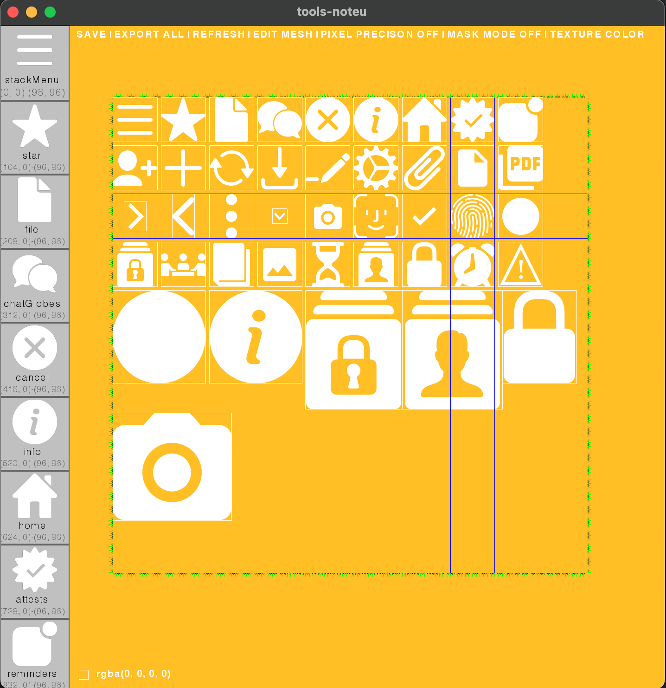
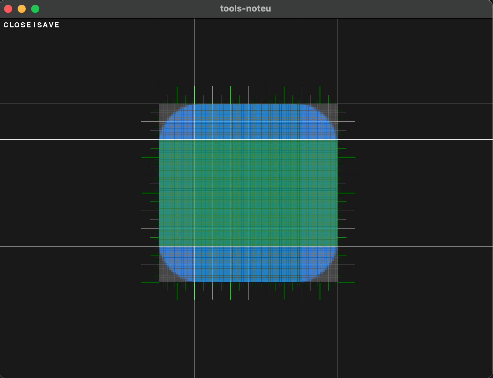

# Moved to Github

This repository was moved to Github. My original repository has ~7 years of activity from 2016-04-27 to 2023-01-11:

https://bitbucket.org/nicaraguabinary/sys-noteu-src/

# sys-noteu-src

Visual tool for building texture-atlas and stretchable PNG/JPG images:

- The columns/rows metadata is injected into the PNG/JPG file.
- The metadata can be used by an app to strech the image as an table or button backgroud.

Other...

# Editors

## Atlas editor

This allows you to create or edit a PNG image that contains other images and set subimages names.

The atlas' map is saved inside the PNG image as metadata.

With an atlas, your final app can save storage-space and load-times.

## Mesh editor

This allows you to define rows and columns properties of a mesh image. Each column/row can be fixed, elastic or repeteable.

The mesh's map is saved inside the PNG image as metadata.

With a mesh, you can use small-images as source for button's backgrounds, scroll-bars and similar UI components.

